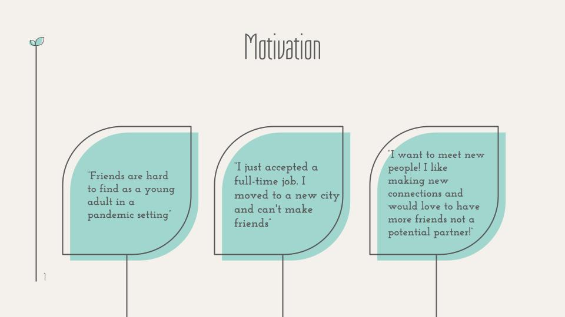
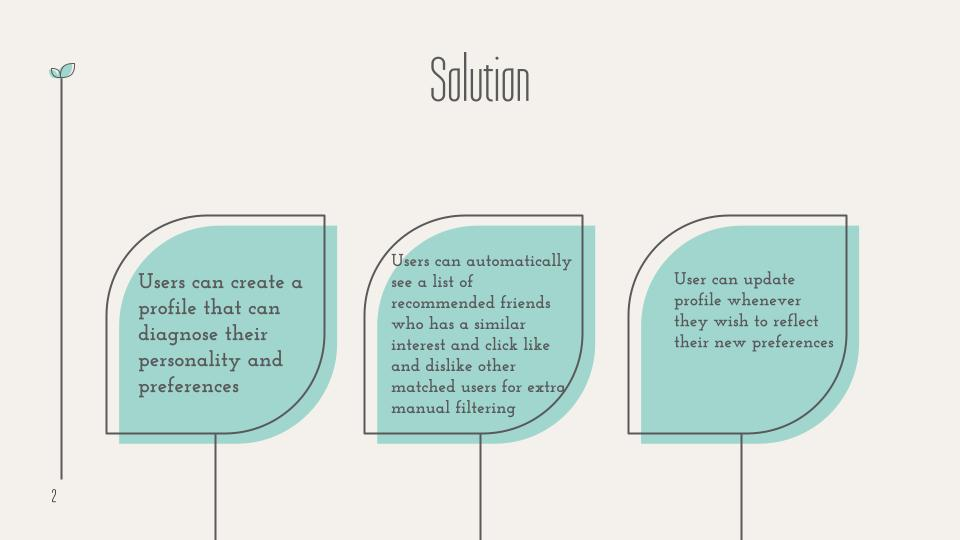
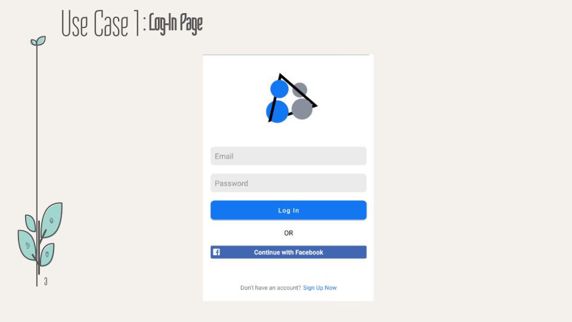
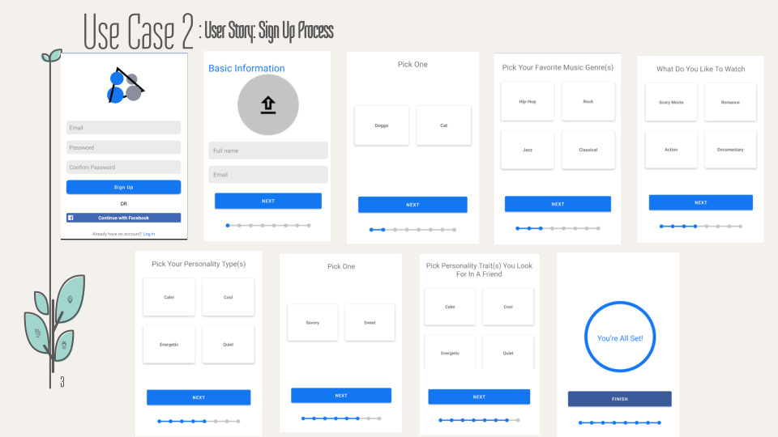
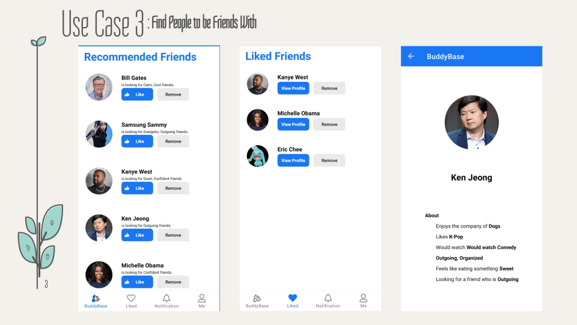
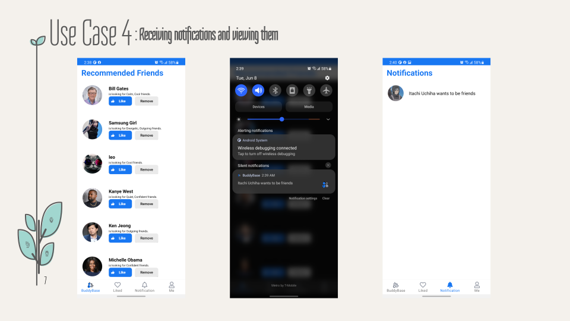
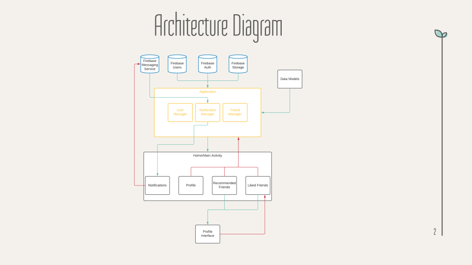
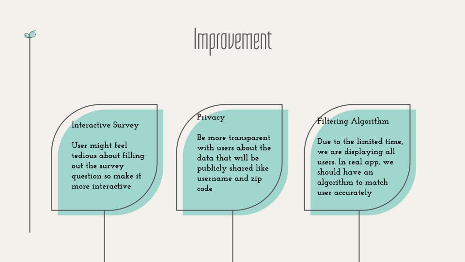

# BuddyBase

This app is designed to find friends for the user to connect to. It allows users to see a list of recommended friends, gives them the ability to further interact with them, and can even notify the user when someone wants to be friends with them.

Here are some slides for this project:

